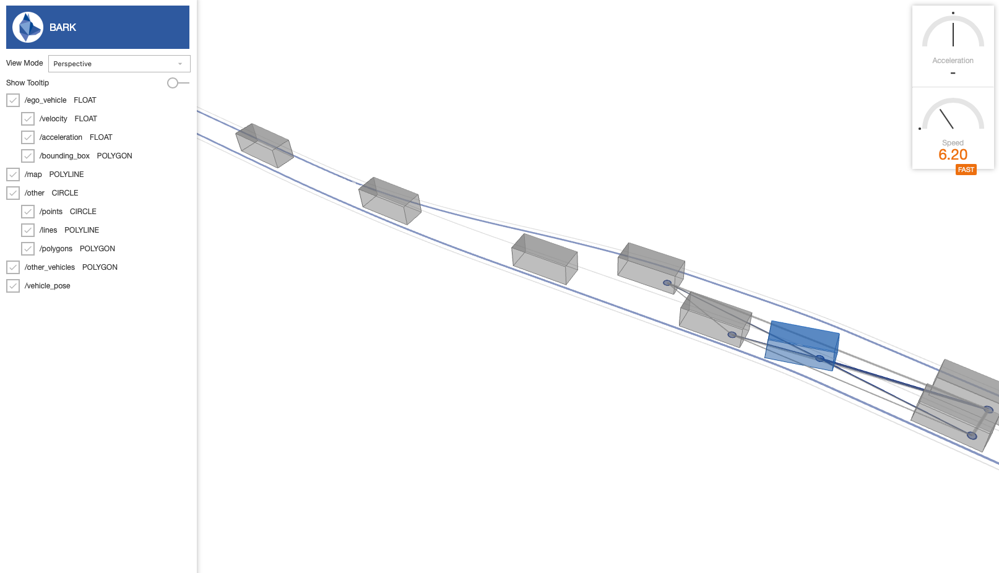

# BARKSCAPE

A web-visualization for BARK built using [streetscape](https://github.com/uber/streetscape.gl) and [xviz](https://github.com/uber/xviz).

## Install, Build and Run Web-Interface

To install all required packages and run the webserver, run the command:
`bazel run //web_interface:server`

## Install Python Environment

Before executing any BARK specific code, make sure to install the virtual environment and enter it.

To install the virtual environment run: `bash utils/install.sh`

To activate the virtual environment run: `source utils/dev_into.sh`

## Run BARK

Once the webserver is started, the BARK example can be visualized using:
`bazel run //tests:bark_runtime_tests`

## Run BARK-ML

Similarily, for BARK-ML use:
`bazel run //tests:bark_ml_runner_tests`